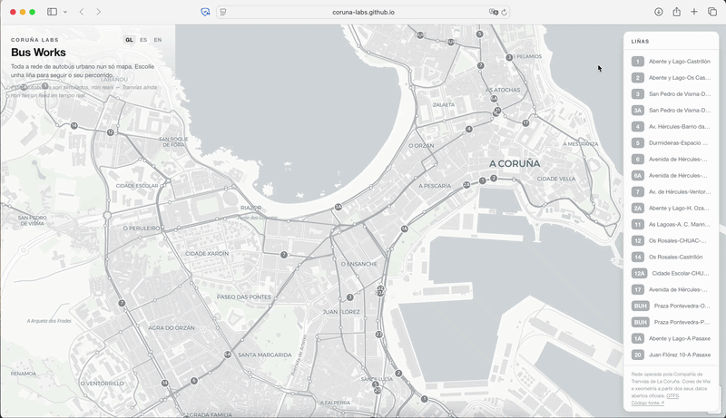

# Bus Works — A Coruña Bus Network

A single, full-screen live map of A Coruña's entire city bus network. The whole
network rests in a quiet grey; select a line and it comes forward in the
operator's own official color, its buses moving along their real routes.

A tool by **[Coruña Labs](https://corunalabs.org)** — an independent civic-tech
lab building open, well-made tools on public data for A Coruña.

**Live:** [busworks.corunalabs.org](https://busworks.corunalabs.org)



## Inspiration

Bus Works follows in the spirit of the **[MTA Live Subway Map](https://www.mta.info/map/5346)**,
designed by **[Work & Co](https://work.co/news/mta-new-live-subway-map/)** with the
MTA and the Transit Innovation Partnership — a web-based map that continually
redraws the network and shows trains moving in real time, no app to download.
Bus Works brings that same idea to A Coruña's buses: open it, see the network,
watch the city move.

## The data, and why the buses are simulated

The static network — every route and stop — comes from the operator's official
**GTFS** feed, published through Spain's national transport portal (NAP):
[dataset 1376](https://nap.transportes.gob.es/Files/Detail/1376), Compañía de
Tranvías de La Coruña. 25 lines, 538 stops, real route geometry.

The **moving buses are simulated.** A Coruña has no public real-time (GTFS-RT)
feed yet, so this demo animates buses along their real routes to show what a
live map looks like. The animation runs entirely in the browser — no server,
no data feed — which is why the hosted site needs nothing running behind it.

This is deliberate, and it's part of the point: **the city's network deserves a
real-time feed.** A working demo makes that case better than a proposal. The
code for a live version already exists in this repo (`worker.js`) and is ready
to connect the day an official feed is published.

## How it works

Pure static site — HTML, CSS, one JavaScript file, and GeoJSON. No build step,
no framework, no server.

- **Basemap:** CARTO Positron (light grey, free, no API key).
- **Map engine:** MapLibre GL (open-source, no billing).
- **Routes & stops:** converted from GTFS to GeoJSON, drawn as vector layers.
- **Buses:** simulated in-browser — each bus follows its line's real geometry,
  advancing every animation frame at a realistic ~18 km/h. Selecting a line
  brightens its buses to the official color; the rest stay muted.
- **Trilingual:** Galician (default), Spanish, English. Language and selected
  line are shareable via URL (`?lang=en&line=6A`) and remembered across visits.

### Run locally

Because the map loads GeoJSON with `fetch`, open it through a local server (not
by double-clicking the file):

```bash
python3 -m http.server 8000
# then open http://localhost:8000
```

That's it — the buses animate on their own.

### The files

- `index.html` — the whole app
- `data/routes.geojson`, `data/stops.geojson` — the network
- `official_colors.json` — the operator's line colors
- `split.js` — splits a combined GTFS-to-GeoJSON export into routes + stops
- `simulate-buses.js` — generates a static bus snapshot (not used by the live
  demo, which simulates in-browser; kept for testing)
- `worker.js` + `WORKER-DEPLOY.md` — the live-data path: a Cloudflare Worker
  that proxies real iTranvías positions, for when a feed exists

Built with Claude (Anthropic) as a coding tool — GTFS-to-GeoJSON conversion,
the MapLibre layer and expression logic, the in-browser path simulation, and
the reverse-engineered iTranvías proxy were drafted and iterated with it, under
the author's direction. Worth noting plainly: the energy and cost of that
assistance are real but hard to quantify — per-session figures aren't published,
and estimates for tool-using AI work span a wide range.

## License

MIT.

## Data sources

- GTFS network: [NAP dataset 1376](https://nap.transportes.gob.es/Files/Detail/1376),
  Compañía de Tranvías de La Coruña.
- Line colors: Compañía de Tranvías de La Coruña.
